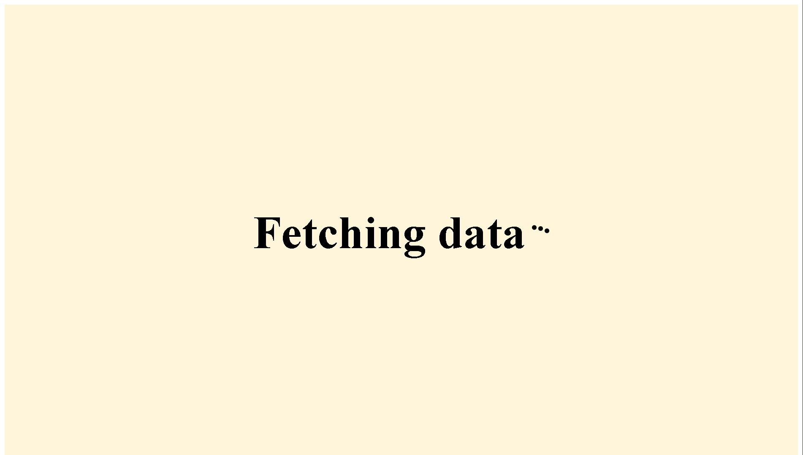

# Simple Next.js Website

Welcome to the Simple Next.js Website repository! This project is a basic web application built with Next.js that fetches and displays a list of names, ages, and emails. It includes sorting functionality for each column and has some animations to enhance the user experience.


## Features

- Fetches a list of user data (names, ages, and emails)
- Sortable columns for easy data organization
- Smooth animations for a polished look

## Getting Started

### Prerequisites

- Node.js
- npm or yarn

### Installation

1. Clone the repository:

   ```bash
   git clone https://github.com/HorikitaSuzuneTsundere/Earl-John-Masaga-v1.git
   ```

2. Navigate to the project directory:

   ```bash
   cd Earl-John-Masaga-v1
   ```

3. Install the dependencies:

   ```bash
   npm install
   ```

   or

   ```bash
   yarn install
   ```

4. Run the development server:

   ```bash
   npm run dev
   ```

   or

   ```bash
   yarn dev
   ```

5. Open your browser and go to `http://localhost:3000`.

## Future Improvements

This project is a work in progress, and there are exciting plans for enhancements, including:

- Transforming the site into a fully-featured dating app
- Implementing user authentication
- Adding profile creation and matching algorithms
- Enhancing UI/UX design with responsive layouts and better animations
- Integrating a backend service for user data storage and management

## Contributing

Contributions are welcome! If you have suggestions for improvements or new features, please feel free to submit a pull request or open an issue.

## License

This project is licensed under the MIT License. See the [LICENSE](LICENSE) file for details.
